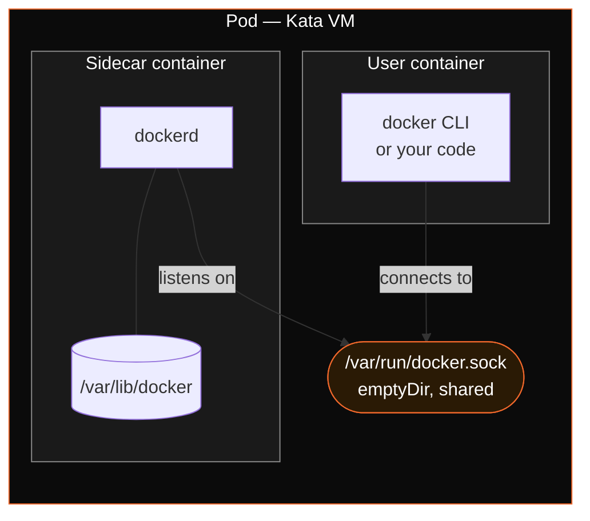
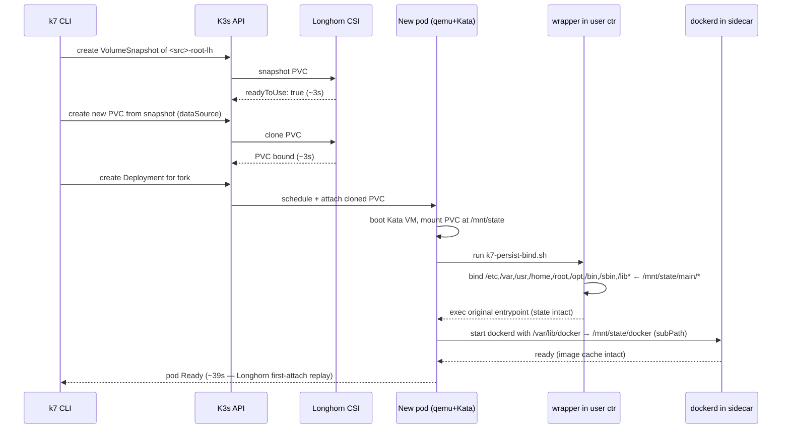

Quick deep-dive on a piece of plumbing in K7: **forking a running sandbox that has Docker inside, where the forked sandbox boots with the parent's Docker image cache already there.**

The docker-in-VM part itself was easy — a sidecar, done quickly. The hard part was the storage layer underneath, and the order in which I figured things out went roughly like this.

## The journey (boring on paper, painful in practice)

I built K7 originally on top of `k3s + kata + firecracker + devmapper-snapshotter (LVM thin pool)`. Reason was simple: tiny attack surface, and the devmapper thin pool gives you cheap copy-on-write on a single node. Perfect for spawning dozens of micro-VMs per node without exploding disk usage.

That shipped, hit Show HN #1, all good.

Then people came back asking for **pause / resume / fork**. Not just "scale the pod to zero" — actual disk snapshots. I want to pause this sandbox, come back tomorrow, resume *exactly* where I left off. And I want to clone it into N branches and run them in parallel.

Ok, so: snapshots and clones. Technically possible on devmapper LVM (`lvcreate --snapshot`). But as soon as I started thinking about **HA / multi-node** — fork onto a different node, or replicate the snapshot somewhere safe — devmapper started being a problem. It's a per-node block-device thing. Cross-node replication of LVM thin snapshots is not something you want to be the person inventing.

So I went looking for a CSI-native distributed block store that already solved this. Longhorn was the obvious fit: per-PVC replicated volumes, native `VolumeSnapshot` + `dataSource` clone, runs on K3s, no external deps.

But Longhorn does not play nice with Firecracker. Firecracker's microVM expects a particular block-device layout, and Kata's Firecracker integration assumes specific storage paths that Longhorn's block-mode CSI doesn't expose cleanly. I tried various routes and concluded: not worth the fight. I'd be reverse-engineering the Kata Firecracker shim.

So I switched the heavy/persistent backend to **qemu instead of Firecracker**. Kata-qemu happily mounts a Longhorn PVC as the VM disk via virtio-blk. K7 still keeps `kata-firecracker-devmapper` as a backend for **ephemeral** workloads (super fast boot, no persistence), and adds **`kata-qemu-longhorn`** as the backend for **stateful** workloads (slower boot, persistent disk, snapshot + fork).

Now the **docker-in-VM** part. I had already shipped the sidecar pattern on `kata-firecracker-devmapper`:



Sidecar runs `docker:27.5-dind`. User container runs your image with the `docker` CLI. They share `/var/run/docker.sock` via `emptyDir`. Both containers run inside the **same Kata VM**, so the VM is the security boundary, not the container. Which means the sidecar doesn't need `--privileged` on the host — it just needs root inside its own VM, which is fine. This is the whole point of running on Kata in the first place.

This pattern transfers cleanly to `kata-qemu-longhorn`. Same sidecar, same socket. The harder problem isn't actually the sidecar — it's making sure **all the state worth forking actually lands on the PVC** in the first place.

## The keystone: bind-mount the container's root onto the PVC, then wrap the entrypoint

This is the bit that took me a minute and is, honestly, where the post earns its keep. Important: this part is **not Docker-specific**. It applies to every `kata-qemu-longhorn` sandbox, with or without the docker sidecar.

Here's the problem. In Kata, a container is a process tree inside a microVM. The VM's rootfs comes from a stack of read-only layers (the image), and on top of those Kata mounts a writable overlay where the container's runtime writes go. That writable overlay lives **inside** the VM, not on the PVC. So if a user does `apt install`, `pip install`, edits `/etc/something`, drops files in `/root`, builds caches under `/var` — all of that is sitting in an ephemeral overlay that the host never sees, and that the PVC snapshot will never contain. Snapshot the PVC, fork, and the new sandbox boots with a fresh image and none of the state.

Mounting the PVC at `/mnt/state` is not enough on its own. You need to redirect the writes that *would* go to the overlay so they land on the PVC instead. The clean way to do that, without modifying every user image, is:

1. **An init container seeds the PVC** with the directory structure the wrapper expects (`/mnt/state/main`, plus a `/mnt/state/docker` subdir if the docker sidecar is requested), then drops a `.ready` marker.
2. **The user container's `command` is replaced** with a small shell wrapper (`k7-persist-bind.sh`, mounted in via a ConfigMap). The image's original `Entrypoint` + `Cmd` are passed to it as `args`.
3. K7 figures out what the original argv actually is by **fetching the image's OCI config from the registry** (`/v2/<repo>/manifests/<tag>` → config blob → `Entrypoint` + `Cmd`). This way the wrapper can `exec` the original command verbatim once it's done — the user image runs exactly as it would have, just with persistent root dirs underneath it.
4. The wrapper waits for `.ready`, then `mount --bind`s each of `/etc`, `/var`, `/usr`, `/home`, `/root`, `/opt`, `/bin`, `/sbin`, `/lib`, `/lib64` from `/mnt/state/main/<dir>` onto the corresponding directory in the VM. First time around it `tar`-seeds each persist dir from the image's contents so nothing breaks; on subsequent boots (and on forks) the seed is a no-op and the bind picks up the parent's writes.
5. Then it `exec "$@"` and the user's original entrypoint takes over, now writing into directories that physically live on the Longhorn PVC.

That single mechanism is what makes fork meaningful. Every package install, every config edit, every cache file, every dotfile, every `~/.something` written by your tool — it's all on the PVC. Snapshot captures it. Clone preserves it. The fork boots with the same OS state.

The docker sidecar then plugs into the **same PVC** via `subPath: docker`, so `/var/lib/docker` inside the sidecar maps to `/mnt/state/docker/` on the same volume:

- Image layers, metadata, volumes, build cache → on the PVC.
- One snapshot of the PVC atomically captures both the user-container OS state *and* the docker daemon state.
- Fork the PVC, attach the clone, dockerd in the fork boots and finds the parent's full image cache. Everything Just Works.

It sounds boring. It is the keystone. Without the wrapper, fork on a `kata-qemu-longhorn` sandbox is theatre — you fork an empty rootfs.

## What it looks like

Stateful sandbox with Docker inside:

```bash
k7 create --sidecar docker --backend kql my-builder docker:27.5-cli
k7 shell my-builder

# inside the sandbox:
docker pull pytorch/pytorch:2.4.0-cuda12.1-cudnn9-runtime
docker build -t myapp .
```

Then fork it 8 times in parallel:

```bash
for i in $(seq 0 7); do
  k7 fork my-builder exp-$i &
done
wait
```

Each `exp-N` boots with the same OS state, the same installed packages, and the same Docker images already pulled. No re-install, no re-pull, no re-build. Confirm:

```bash
k7 shell exp-3
docker images   # the pytorch image is right there
```

This is the workflow that pushed me to ship this. AI agents that want to **prepare one heavy environment and explore N branches in parallel** — fine-tuning sweeps, bisection, multi-config CI — are forever paying the setup cost N times. With fork, they pay it once.

## The fork sequence under the hood



End-to-end: **44.9 s** on a single Hetzner dedicated node (3× NVMe, Longhorn `replicas=1`). Most of that time is Longhorn replaying the cloned data on first attach — not something K7 can magic away. Snapshot is 7s, the clone PVC is bound in 3s, the rest is attach + VM boot.

For comparison: 8 cold creates would be `8 × 15.2s ≈ 2 minutes` plus `8 × before_script` (which for a torch + transformers env is easily 5+ minutes). Fork-8-in-parallel: **~53 s total**, no re-installs.

```
Operation                       latency
─────────────────────────────────────────
Cold create → pod ready         15.2 s
Snapshot ready                   7.0 s
Pause (scale to 0)               0.13 s
Resume (scale to 1 + ready)      4.5 s
Fork (total)                    44.9 s
  — snapshot                     3.0 s
  — clone PVC bound              2.7 s
  — deployment ready            39.2 s
```

(Live numbers in [`PERFORMANCE.md`](https://github.com/Katakate/k7/blob/main/PERFORMANCE.md), updated as I improve the path.)

### Where this goes next: warm pools

The 45 s number is honest, but it's bottlenecked by *cold* path work — scheduling a fresh pod, booting a new Kata VM, Longhorn's first-attach replay. None of that is fundamental to fork; it's just what happens when you start from zero every time.

The planned next step is **warm pools**: keep a small fleet of pre-booted, idle Kata VMs with an empty PVC already attached, sitting around per node. When `k7 fork` lands, instead of "create deployment → schedule → boot VM → attach clone", we do "grab a warm pod → swap its PVC for the clone → mark Ready". Snapshot + clone of the PVC stay roughly constant (~6 s combined), but the ~39 s of "deployment ready" collapses to PVC swap + reattach + bind-wrapper, which I expect to land **comfortably below 10 s** end-to-end. Same fork semantics, no API changes, just a pool size knob.

I haven't shipped this yet — wanted to land the correctness story first (does fork actually preserve state? yes) before optimizing the hot path. Coming soon.

## "But isn't this just Docker-in-Docker with extra steps?"

I expected this one. Short answer: no, and the difference matters.

- **DinD** runs `dockerd` *inside the user container*, which has to be `--privileged` on the host. Cgroup edge cases, overlay-on-overlay storage, much wider blast radius if anything escapes. And — the part I care about most in practice — every container the user spawns becomes a **container nested inside another container**. That's the situation I explicitly want to avoid: nested containerization is messy (overlay-on-overlay, cgroup-on-cgroup, networking gymnastics), it's where most of the "DinD horror story" content on the internet comes from, and it makes lifecycle/observability/cleanup unnecessarily painful.
- **K7's sidecar** runs `dockerd` in a *separate* container, with its own filesystem, sharing only a Unix socket with the user container via `emptyDir`. When the user runs `docker run ...`, the resulting container is a **sibling** of the user container (both managed by the sidecar's dockerd), not a child *inside* it. No nesting, no overlay-on-overlay, no privileged user container. Both containers live inside the **same Kata VM**, which is the actual security boundary. The host kernel never sees a privileged container — it sees a Kata-managed qemu process.

This is the "VM-as-boundary" mental model. It also means I can swap the daemon — `containerd` instead of Docker, or eventually Postgres / Redis / your-favorite-stateful-thing — without touching the security story.

## Sidecars are just a registry

The sidecar config is a single Python dict. Adding a new daemon is one entry:

```python
# src/k7/core/sidecar.py (sketch)
SIDECARS = {
    "docker": SidecarSpec(
        image="docker:27.5-dind",
        socket_path="/var/run/docker.sock",
        data_path="/var/lib/docker",
        readiness_cmd=["docker", "info"],
    ),
    "containerd": SidecarSpec(  # planned
        image="containerd:1.7",
        socket_path="/run/containerd/containerd.sock",
        data_path="/var/lib/containerd",
        readiness_cmd=["ctr", "version"],
    ),
}
```

Same lifecycle (init container creates the data dir on the PVC, sidecar boots, readiness probe runs, k7 marks the sandbox Ready when all containers are Ready). Same fork story (data lives on the PVC, fork clones the PVC, daemon boots in the fork with state intact).

Obvious next target on the list: **`postgres` sidecar.** AI agents that want a sandboxed Postgres they can fork — "try this migration on 8 branches in parallel", "show me row counts after each of these 8 candidate queries" — drop right into the same recipe. Bind-mount `/var/lib/postgresql/data` onto the PVC, fork clones the PVC, forked Postgres comes up with the parent's data. Single registry entry, no changes to core.

If you have an opinion on which sidecar should ship next, the issue tracker is open.

## Limitations, honest

- **Fork is `kata-qemu-longhorn` only.** `kata-firecracker-devmapper` is intentionally ephemeral — still the right choice when you want "spawn 100 quick VMs that don't need to survive."
- **Fork is disk-only.** It clones `/mnt/state` (filesystem, Docker images, daemon data). It does **not** clone memory, CPU registers, or process state. The forked sandbox boots fresh and re-runs your `before_script`. Memory clone is a separate, much harder problem — CRIU on Kata is research, not shipped.
- **45 s fork latency** today is dominated by cold pod scheduling + Kata VM boot + Longhorn's first-attach replay. Warm pools (above) are the planned fix and should bring this below 10 s without changing the fork semantics.
- **Single-node tested.** Multi-node fork (from node A onto node B) works in theory through Longhorn's replicated volumes, but I haven't benchmarked it properly. On the roadmap.
- **Write-heavy workloads pay a Longhorn tax.** The path for any write inside the sandbox is `container → kata-qemu virtio-blk → kubelet mount → longhorn-engine → longhorn-replica → disk`, which is a taller stack than running docker on bare disk. CPU-bound `docker run` workloads should be close to native; **`docker build` and other small-file/fsync-heavy workloads will be noticeably slower** than the same workload on the host. The gap grows with `replicas≥2` (each write becomes a network sync to remote replicas). I'm gathering proper numbers vs host-native docker — they'll land in [`PERFORMANCE.md`](https://github.com/Katakate/k7/blob/main/PERFORMANCE.md). If your workload is "build a wheelhouse / build a giant image inside a sandbox", measure for your case before committing.

## Try it

[](https://github.com/Katakate/k7)

```bash
# install the CLI, then provision the node (K3s + Kata + qemu + Longhorn)
apt install k7
k7 install --backend kql

# stateful sandbox with Docker inside
k7 create --sidecar docker --backend kql my-builder docker:27.5-cli
k7 shell my-builder
# ... do whatever you want with docker ...

# fork it
k7 fork my-builder exp-1
```

<CardGroup cols={2}>
<Card title="Sidecars guide" icon="layer-group" href="/k7/guides/sidecars">
Full Docker-in-VM reference — config, network, storage table.
</Card>
<Card title="Snapshots & fork guide" icon="code-branch" href="/k7/guides/snapshots-fork">
The pause / resume / fork CLI surface, with measured latencies.
</Card>
<Card title="Architecture" icon="diagram-project" href="/k7/concepts/architecture">
How K3s + Kata + qemu/Firecracker + Longhorn fit together.
</Card>
<Card title="Security model" icon="shield-halved" href="/k7/concepts/security-model">
What the Kata VM boundary buys you, and what it doesn't.
</Card>
</CardGroup>

<Card title="Star K7 on GitHub" icon="github" href="https://github.com/Katakate/k7">
If this was useful, a star helps more people find K7.
</Card>

K7 is Apache 2.0 on [github.com/Katakate/k7](https://github.com/Katakate/k7). Issues + contributions welcome — the sidecar-of-the-week list is short and exciting. thx
