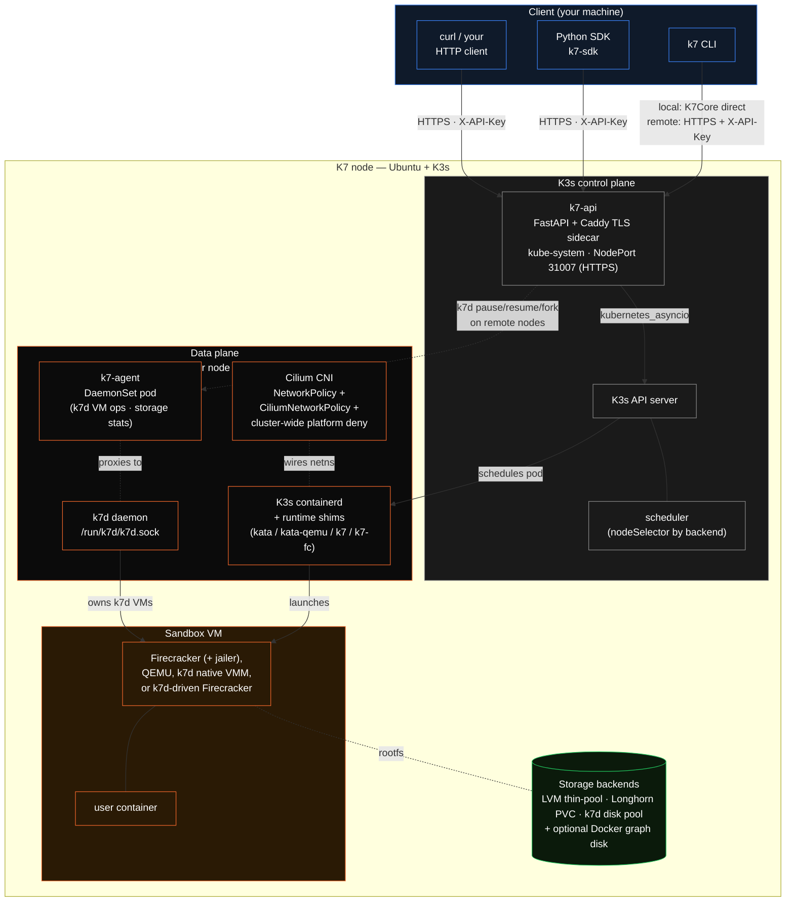

Katakate is a thin orchestration layer over a curated stack of battle-tested infrastructure. This page explains what the moving parts are and how they talk to each other.

## High-level diagram



## Components

### CLI — `k7`

A Typer-based CLI distributed as a Debian package (`apt install k7`). Sandbox-management commands (`create`, `list`, `fork`, …) talk to the **K7 API** by default. Node-local commands (`install`, `generate-api-key`, `shell`, `top`) still run on the cluster. Hidden `--core` bypasses the API and calls `K7Core` in-process. Interactive `k7 shell` shells out to `kubectl exec`.

### API — `k7-api`

A FastAPI service that exposes a REST surface for sandbox lifecycle and exec. The API runs as a **K3s `Deployment`** in `kube-system` with a `NodePort` Service (31007), an in-cluster `ServiceAccount`, and a scoped `ClusterRole`. The pod carries a **Caddy TLS sidecar**: FastAPI listens on `:8000` inside the pod, Caddy terminates HTTPS on the NodePort with a cluster CA the installer writes to `/etc/k7/tls/ca.crt` (or a Let's Encrypt / operator-supplied certificate). On Cilium clusters `k7 install --api-allow-cidr` adds a `CiliumNetworkPolicy` (`k7-api-ingress`) restricting who can reach the port. See [API transport](/k7/concepts/security-model#api-transport-tls). Temporarily stop it with `k7 api disable` (scale to 0) and bring it back with `k7 api enable`.

The entire `K7Core` is async (`kubernetes_asyncio` + `httpx`), so the API can serve concurrent requests without thread-pool workarounds.

### Per-node agent — `k7-agent`

A **DaemonSet** in `kube-system` (same image as `k7-api`, running `k7.api.agent:app`) that exposes node-local operations the central API can't do remotely: k7d VM ops (`pause` / `resume` / `fork` / `lookup`, which need the node's `/run/k7d/k7d.sock` and containerd socket) and storage-pool utilization (`GET /agent/v1/storage`). When a k7d sandbox lives on a different node than the k7-api pod, the API forwards the VM op to that node's agent, authenticated with a shared token provisioned by the installer (`/etc/k7/agent_token`) and locked down by a CiliumNetworkPolicy so only the k7-api pod can reach the agents. If no agent is Ready on the target node, the operation fails loudly — never a silent no-op.

### Python SDK — `k7-sdk`

A small `requests`/`httpx` wrapper published to PyPI as **`k7-sdk`** (`from k7_sdk import Client`). Both `Client` (sync) and `AsyncClient` (async, `pip install "k7-sdk[async]"`) speak the same JSON envelope as the API.

### K3s

The CNCF-certified Kubernetes distribution we install on every node. K3s is single-binary, supports embedded etcd for HA, and ships its own containerd. Katakate **does not touch your existing Docker or containerd** — K3s installs its own runtime so installation is non-disruptive.

### Cilium

Cilium is the default CNI plugin. It enables **FQDN-based egress** (e.g. allow `api.openai.com` instead of a CIDR) via `CiliumNetworkPolicy`. Cilium runs with `kubeProxyReplacement=true` for a leaner stack. Pass `--cni flannel` at install time to fall back to K3s' default CNI (CIDR-only egress).

### Kata Containers

Kata is the OCI runtime that turns each pod into a lightweight VM. We install both runtime classes:

- `kata` — Firecracker microVMs (used by `kata-firecracker-devmapper`)
- `kata-qemu` — QEMU-based VMs (used by `kata-qemu-longhorn`)

Kata guest seccomp is enforced (`disable_guest_seccomp = false`) on both classes.

The other two runtime classes are not Kata. `k7` and `k7-fc` are both served by the [k7d](/k7d/index) containerd shim (`containerd-shim-k7-v1`) talking to the node-local `k7d` daemon; `k7-fc` differs only by a per-runtime `ConfigPath` (`/etc/k7d/shim-k7-fc.toml`, `backend = "firecracker"`) that tells k7d to drive stock Firecracker under the stock jailer instead of its own VMM. See [k7d backends](/k7d/concepts/backends).

### Backends

A **backend** is a tuple of (runtime class, storage driver). There are four:

| Backend | Alias | Runtime | Storage | Best for |
|---------|-------|---------|---------|----------|
| `kata-firecracker-devmapper` | `kfd` | Kata + Firecracker + jailer (`kata`) | LVM thin-pool snapshotter | Lightest footprint, fastest cold boot, ephemeral workloads |
| `kata-qemu-longhorn` | `kql` | Kata + QEMU | Longhorn CSI (replicated PVCs) | Persistent volumes, disk-level snapshot/pause/resume/fork |
| `k7d` | — | [k7d Rust VMM](/k7d/index) (`runtimeClassName: k7`) | erofs on virtio-blk + host-local state | ~5 ms warm fork, snapshot trees, RL / agent tree search |
| `k7d-fc` | `k7-fc` | k7d daemon driving stock Firecracker + jailer (`runtimeClassName: k7-fc`) | erofs on virtio-blk + host-local state | Firecracker isolation (jailer, seccomp) with k7d fork/tree/pool semantics; multi-tenant `--docker` |

A node can support **one or more** backends; on a multi-node cluster, different nodes can specialize. See [Backends](/k7/concepts/backends) for a deeper comparison.

### Storage — Longhorn (kata-qemu-longhorn only)

[Longhorn](https://longhorn.io/) provides cluster-wide replicated block storage via a Kubernetes CSI driver. Each `kata-qemu-longhorn` sandbox gets its own root PVC (`<sandbox>-root-lh`), backed by `numberOfReplicas` replicas spread across nodes. The default StorageClass uses `WaitForFirstConsumer` binding and `dataLocality: best-effort` so the volume is created on (and one replica stays on) the node where the pod is scheduled. VolumeSnapshots power `pause`/`resume`/`fork`.

### Storage — devmapper thin-pool (kata-firecracker-devmapper only)

A raw disk is provisioned as an LVM thin-pool. Containerd's devmapper snapshotter creates per-sandbox logical volumes from this pool, giving each microVM its own block device while sharing the underlying physical storage efficiently. `--docker` sandboxes on this backend get an ephemeral graph LV through the `k7-docker-lvm` StorageClass (OpenEBS LVM LocalPV).

### Storage — Docker graph disks (`--docker`)

A sandbox created with `--docker` gets a dedicated block device for Docker's `overlay2` graph: a Longhorn PVC `<name>-docker-lh` on `kql`, an LVM LocalPV on `kfd`, or a per-VM scratch disk on `k7d` / `k7d-fc` that is reflinked on fork. See [Docker in a sandbox](/k7/guides/docker).

## Request lifecycle: `k7 create`

1. **Client → API**: `POST /api/v1/sandboxes` with a `SandboxConfig` JSON body. The API validates the API key (SHA-256 hashed, timing-safe compare), enforces optional per-key namespace scope, checks the image registry host against the public allowlist (SSRF guard), and forwards to `K7Core.create_sandbox`.
2. **K7Core**: builds a Kubernetes `Deployment` (1 replica), an optional `Secret` from `env_file`, an optional `PVC` (`<name>-root-lh`) on `kata-qemu-longhorn`, an optional Docker graph disk, an ingress `NetworkPolicy` (deny-all, or opened for `ingress_ports` / `ingress_from`), an optional NodePort Service for `expose_ports`, and either a CIDR `NetworkPolicy` or a `CiliumNetworkPolicy` for egress. The always-on `CiliumClusterwideNetworkPolicy` `k7-sandbox-platform-deny` (installed once per cluster) keeps every sandbox off nodes, the apiserver and platform namespaces regardless of these per-sandbox objects.
3. **K3s scheduler** picks a node based on `nodeSelector` (`k7.katakate.org/backend-<backend>=true`, set by the installer per host).
4. **Kata or k7d** (via the appropriate containerd shim) launches a VM, mounts the rootfs (devmapper or Longhorn PVC), and starts the user container inside it.
5. **`before_script`** runs via `kubectl exec` while egress is still open. Once it completes, the egress NetworkPolicy is applied and the pod is marked Ready.
6. The API returns `201 Created` with a `Location` header.

## Source code map

```
src/
├── k7/
│   ├── api/        FastAPI service (Dockerfile + manifests deploy as a K3s Deployment)
│   ├── cli/        Typer CLI, packaged as the k7 .deb
│   ├── core/       K7Core: async sandbox lifecycle (Kubernetes + Longhorn + Cilium)
│   │   ├── core.py      orchestration
│   │   ├── models.py    SandboxConfig / SandboxInfo / ExecResult dataclasses
│   │   ├── docker.py    --docker: graph disks, docker-vehicle (Kata) / k7d annotations
│   │   └── sidecar.py   legacy sidecar registry (kept for the deprecated --sidecar alias)
│   └── deploy/     Ansible playbook + manifests
│       ├── k7_api_tls.py   Caddy TLS sidecar rendering for k7-api
│       └── k7d-fc/         install-firecracker.sh (pinned Firecracker + jailer for k7d-fc)
└── k7_sdk/         Python SDK (PyPI package k7-sdk)
```
