Katakate is built for **executing untrusted code** — model output, third-party scripts, anonymous CI jobs. The threat model assumes the workload inside a sandbox is hostile and tries to escape, exfiltrate data, or attack other tenants.

This page summarizes the layered defenses; for hands-on configuration see the [API security & networking reference](/k7/api/security).

## Defense in depth

Each boundary below has to be defeated before an attacker reaches the next one. The untrusted workload is at the center; the cluster is the outermost ring.

```mermaid
flowchart TB
    Attacker(["attempted escape<br/>(malicious workload)"])

    subgraph Cluster["Cluster boundary — K3s + Cilium"]
        direction TB
        C1["Cilium NetworkPolicy<br/>ingress denied by default"]
        C2["Egress locked per sandbox<br/>(CIDR or FQDN allowlist)"]
        C3["Per-sandbox filesystem<br/>devmapper LV / Longhorn PVC"]

        subgraph Host["Host boundary — Kata + KVM"]
            direction TB
            H1["Kata Containers<br/>pod = lightweight VM"]
            H2["Firecracker / QEMU<br/>hardware virtualization (KVM)"]
            H3["Firecracker jailer<br/>chroot · dropped caps · seccomp"]
            H4["Minimal device exposure<br/>(virtio only)"]

            subgraph Container["Container boundary — pod spec"]
                direction TB
                K1["cap_drop: ALL"]
                K2["allowPrivilegeEscalation: false"]
                K3["Seccomp: RuntimeDefault"]
                K4["Optional non-root<br/>UID/GID 65532"]

                subgraph Workload["Untrusted workload"]
                    W["model output · third-party scripts<br/>anonymous CI jobs"]
                end
            end
        end
    end

    Attacker -. "must defeat every layer" .-> Workload

    classDef cluster fill:#0b1a0b,stroke:#22c55e,color:#fff;
    classDef host fill:#2a1a05,stroke:#ef672b,color:#fff;
    classDef container fill:#1a1a1a,stroke:#888,color:#fff;
    classDef workload fill:#0f1a2a,stroke:#3b82f6,color:#fff;
    classDef attacker fill:#1a0b0b,stroke:#ef4444,color:#fff;
    class Cluster,C1,C2,C3 cluster;
    class Host,H1,H2,H3,H4 host;
    class Container,K1,K2,K3,K4 container;
    class Workload,W workload;
    class Attacker attacker;
```

A successful escape from the workload has to defeat every layer above before it can reach another tenant or the host.

## VM isolation

Every sandbox is a Kata Containers pod, which means **a real VM with its own kernel** running on KVM. The workload sees a virtio block device for its rootfs, a virtio NIC, and not much else. The virtual hardware surface is tiny compared to a shared host kernel.

- **`kata-firecracker-devmapper`** uses Firecracker — ~50k LoC Rust microVMM, ~5MB resident, ~125ms boot. The Firecracker process runs **inside the jailer**: a chroot jail with an empty filesystem, dropped capabilities, a restrictive seccomp filter, and an unprivileged UID. An integration test (`tests/integration/test_firecracker.py::test_jailer_active`) verifies the jailer is active on every install.
- **`kata-qemu-longhorn`** uses QEMU — bigger surface than Firecracker but still hardware-isolated, and Kata applies its own sandboxing primitives.

## Container hardening

Inside the VM, the user container is further locked down:

| Knob | Default | What it does |
|------|---------|-------------|
| `cap_drop` | `["ALL"]` | All Linux capabilities are dropped unless you explicitly add some back via `cap_add`. |
| `cap_add` | `[]` | Add back only what your workload needs (e.g. `["CHOWN"]`). |
| `allowPrivilegeEscalation` | `false` | Always — `setuid`/file caps cannot raise privileges. |
| Seccomp profile | `RuntimeDefault` | Standard runtime seccomp filter on top of Kata/jailer's own. |
| `pod_non_root` | `false` | Set `true` to run the entire pod as UID/GID/FSGroup 65532 (consistent FS ownership). |
| `container_non_root` | `false` | Set `true` to run the main container as UID 65532. |

<Info>
Some package managers (`apk add`, `apt-get install`) require root inside the container. Either run them in `before_script` with the defaults, or prebuild your image with the dependencies baked in.
</Info>

## Network isolation

- **Ingress is denied by default** — pods cannot talk to each other, even within the same namespace. `kube-system` traffic is allowed for cluster services. `kubectl exec` / `k7 shell` are unaffected (they use the K8s API).
- **Egress is configurable** per sandbox via `egress_whitelist`: open by default, blocked with `[]`, restricted by CIDRs, or restricted by FQDNs (with Cilium). DNS is blocked by default when egress is locked down — see the [Networking](/k7/concepts/networking) page.

## API authentication

- API keys are generated with `secrets.token_urlsafe(32)` and only shown once at creation.
- Stored in `/etc/k7/api_keys.json` (mode 0600) as **SHA-256 hashes** — the plaintext key is never written to disk.
- Comparison uses `secrets.compare_digest` (constant-time, timing-attack resistant).
- Optional **expiry**; expired keys are purged opportunistically on every authenticated request.
- `last_used` timestamp recorded for audit.
- Authenticate via `X-API-Key: <key>` or `Authorization: Bearer <key>`.

The API runs as a K3s Deployment with its own ServiceAccount and a scoped ClusterRole — no admin kubeconfig is ever mounted.

## Operational guidance

1. **Always lock down egress** for untrusted workloads. Prefer FQDN allowlists (Cilium) — much less error-prone than tracking CIDR ranges that change.
2. **Don't whitelist public DNS resolvers** (`1.1.1.1`, `8.8.8.8`) — that re-enables DNS exfiltration.
3. **Rotate API keys** with `k7 revoke-api-key` + `k7 generate-api-key`. Treat them as credentials.
4. **Set a TLS reverse proxy** in front of the NodePort if you expose the API publicly (the NodePort itself is plain HTTP).
5. **Pin image tags** — `:latest` is convenient but non-reproducible. K7 itself pins every image and Kubernetes manifest version it ships; do the same in your sandbox configs.

## Known limitations

- **Pre-1.0 software** under active security review. Avoid for hyper-sensitive workloads until 1.0.
- **No API rate limiting yet** — put a proxy with rate limits in front for public exposure.
- **AppArmor profiles** are on the roadmap (not yet shipped).
- **TEE (Trusted Execution Environment)** support is on the roadmap.

See [SECURITY.md](https://github.com/Katakate/k7/blob/main/SECURITY.md) for the full disclosure policy and reporting channel (security@katakate.org).
