Katakate is built for **executing untrusted code** — model output, third-party scripts, anonymous CI jobs. The threat model assumes the workload inside a sandbox is hostile and tries to escape, exfiltrate data, or attack other tenants.

This page summarizes the layered defenses; for hands-on configuration see the [API security & networking reference](/k7/api/security).

## Defense in depth

Each boundary below has to be defeated before an attacker reaches the next one. The untrusted workload is at the center; the cluster is the outermost ring.

```mermaid
flowchart TB
    Attacker(["attempted escape<br/>(malicious workload)"])

    subgraph Cluster["Cluster boundary — K3s + Cilium"]
        direction TB
        C0["Cluster-wide platform deny<br/>sandboxes never reach nodes,<br/>apiserver, metadata, kube-system"]
        C1["NetworkPolicy<br/>ingress denied by default, opt-in ports"]
        C2["Egress locked per sandbox<br/>(CIDR or FQDN allowlist)"]
        C3["Per-sandbox filesystem<br/>devmapper LV / Longhorn PVC / k7d disk image"]

        subgraph Host["Host boundary — Kata or k7d + KVM"]
            direction TB
            H1["Kata Containers or k7d shim<br/>pod = lightweight VM"]
            H2["Firecracker / QEMU / k7d VMM<br/>hardware virtualization (KVM)"]
            H3["Firecracker jailer (kfd, k7d-fc)<br/>chroot · dropped caps · seccomp"]
            H4["Minimal device exposure<br/>(virtio only)"]

            subgraph Container["Container boundary — pod spec"]
                direction TB
                K1["cap_drop: ALL"]
                K2["allowPrivilegeEscalation: false"]
                K3["Seccomp: RuntimeDefault"]
                K4["Optional non-root<br/>UID/GID 65532"]

                subgraph Workload["Untrusted workload"]
                    W["model output · third-party scripts<br/>anonymous CI jobs"]
                end
            end
        end
    end

    Attacker -. "must defeat every layer" .-> Workload

    classDef cluster fill:#0b1a0b,stroke:#22c55e,color:#fff;
    classDef host fill:#2a1a05,stroke:#ef672b,color:#fff;
    classDef container fill:#1a1a1a,stroke:#888,color:#fff;
    classDef workload fill:#0f1a2a,stroke:#3b82f6,color:#fff;
    classDef attacker fill:#1a0b0b,stroke:#ef4444,color:#fff;
    class Cluster,C0,C1,C2,C3 cluster;
    class Host,H1,H2,H3,H4 host;
    class Container,K1,K2,K3,K4 container;
    class Workload,W workload;
    class Attacker attacker;
```

A successful escape from the workload has to defeat every layer above before it can reach another tenant or the host.

## VM isolation

Every sandbox is a Kata Containers pod, which means **a real VM with its own kernel** running on KVM. The workload sees a virtio block device for its rootfs, a virtio NIC, and not much else. The virtual hardware surface is tiny compared to a shared host kernel.

- **`kata-firecracker-devmapper`** uses Firecracker — ~50k LoC Rust microVMM, ~5MB resident, ~125ms boot. The Firecracker process runs **inside the jailer**: a chroot jail with an empty filesystem, dropped capabilities, a restrictive seccomp filter, and an unprivileged UID. An integration test (`tests/integration/test_firecracker.py::test_jailer_active`) verifies the jailer is active on every install.
- **`kata-qemu-longhorn`** uses QEMU — bigger surface than Firecracker but still hardware-isolated, and Kata applies its own sandboxing primitives.
- **`k7d`** uses Katakate's own KVM VMM (`runtimeClassName: k7`). One daemon hosts every VM; [privilege separation](/k7d/concepts/security#privilege-separation) splits that daemon into a root node broker (no listening socket) and a uid-`k7d` VM broker that parses guest and shim input. Live CoW fork still requires sibling forks of one tree to share the VM broker's address space — that is what makes the ~5 ms fork possible, and it means sibling forks of one tree are isolated more weakly than VMs on separate VMMs. See the [k7d security model](/k7d/concepts/security).
- **`k7d-fc`** keeps the k7d daemon for fork / pause but boots each guest on **upstream Firecracker under the upstream jailer** (`runtimeClassName: k7-fc`): a separate VMM process per VM with its own uid, chroot, pid namespace, cgroup, and Firecracker's seccomp. A guest→VMM escape lands in that jail, not in the daemon. Pick it for multi-tenant `--docker`. Trade-offs: no hostPath / virtiofs, no time warp, a 32 MiB / 50m PodOverhead.

On both Kata backends the pod's `securityContext` reaches the runtime inside the VM: Kata's guest seccomp is enforced (`disable_guest_seccomp = false`), so the container's `RuntimeDefault` profile is applied by the in-guest runtime rather than dropped. The k7d shim likewise passes `linux.seccomp`, `maskedPaths` / `readonlyPaths`, device cgroups, capabilities, and `noNewPrivileges` through to guest `runc`, stripping only what the guest kernel cannot honour (AppArmor profile, host cgroup path, host namespace paths).

## Container hardening

Inside the VM, the user container is further locked down:

| Knob | Default | What it does |
|------|---------|-------------|
| `cap_drop` | `["ALL"]` | All Linux capabilities are dropped unless you explicitly add some back via `cap_add`. |
| `cap_add` | `[]` | Add back only what your workload needs (e.g. `["CHOWN"]`). |
| `allowPrivilegeEscalation` | `false` | Always — `setuid`/file caps cannot raise privileges. |
| Seccomp profile | `RuntimeDefault` | Standard runtime seccomp filter, enforced by the in-guest runtime on top of Kata/jailer's own. |
| `pod_non_root` | `false` | Set `true` to run the entire pod as UID/GID/FSGroup 65532 (consistent FS ownership). |
| `container_non_root` | `false` | Set `true` to run the main container as UID 65532. |

<Info>
Some package managers (`apk add`, `apt-get install`) require root inside the container. Either run them in `before_script` with the defaults, or prebuild your image with the dependencies baked in.
</Info>

<Warning>
`--docker` changes the picture inside the VM. On `k7d` / `k7d-fc` the sandbox container stays unprivileged, but `docker.sock` is guest root — anything that can reach it owns the guest, so the container `securityContext` no longer bounds the VM. On `kfd` / `kql` a privileged `docker-vehicle` container runs in the same Kata VM. In every case the isolation boundary is the VM; see [Docker in a sandbox](/k7/guides/docker).
</Warning>

## Network isolation

- **Sandboxes never reach the platform.** A cluster-wide deny-only `CiliumClusterwideNetworkPolicy` (`k7-sandbox-platform-deny`) blocks every sandbox — even `--egress-open` ones — from the nodes, the Kubernetes API server, cloud metadata / link-local, and `kube-system` / `longhorn-system` pods except CoreDNS. Cilium-only; Flannel clusters do not get this.
- **Ingress is denied by default** and opt-in per sandbox: `--ingress-port` opens TCP ports, `--ingress-from` (`sandbox:` / `namespace:` / `cidr:`) scopes who may connect, `--expose-port` publishes through a `NodePort` with the real client IP preserved. Opening a port without a source means "other sandboxes in this namespace", never the world. `kubectl exec` / `k7 shell` are unaffected (they use the K8s API).
- **Egress is configurable** per sandbox via `egress_whitelist`: open by default, blocked with `[]`, restricted by CIDRs, or restricted by FQDNs (with Cilium). DNS is blocked by default when egress is locked down. Forks inherit the source's policy.
- Details and the `cidr:`-on-Cilium caveat: [Networking](/k7/concepts/networking).

## API transport (TLS)

`k7 install` serves `k7-api` on NodePort `31007` over **HTTPS** by default. The API container stays HTTP on `:8000` (kubelet probes unchanged); a Caddy sidecar in the same pod terminates TLS. API keys no longer travel in cleartext.

| `k7 install` flag | Certificate |
|---|---|
| (none) | Playbook-minted cluster CA at `/etc/k7/tls/ca.crt` (Let's Encrypt cannot issue for a bare IP). Copy that file to your laptop and `k7 config set api.ca ./ca.crt`, or pass `--api-ca` / `K7_API_CA`. |
| `--api-hostname NAME` | Let's Encrypt via Caddy (HTTP-01 on host port 80). `NAME` must be a DNS name whose A record is the first master's IP; a bare IP is refused. Clients use the system trust store. |
| `--api-tls-cert` + `--api-tls-key` | Operator-supplied PEM pair. Incompatible with `--api-hostname`. |
| `--api-insecure-http` | The previous plain-HTTP NodePort, bit for bit. Keys travel in cleartext. Cannot be combined with the hostname or cert flags. |

The CLI and SDK refuse `verify=False` on an `https://` URL — point them at the CA instead. Optionally restrict the NodePort to your client CIDRs with `--api-allow-cidr` ([Networking](/k7/concepts/networking#restricting-who-can-reach-k7-api)). None of this is rate limiting.

## API authentication

- API keys are generated with `secrets.token_urlsafe(32)` and only shown once at creation.
- Stored in `/etc/k7/api_keys.json` (mode 0600) as **SHA-256 hashes** — the plaintext key is never written to disk.
- Comparison uses `secrets.compare_digest` (constant-time, timing-attack resistant).
- Optional **expiry**; expired keys are purged opportunistically on every authenticated request.
- Optional **namespace scope**: `k7 generate-api-key NAME -n <ns>` (repeatable). Enforced on every namespace-bearing endpoint — a scoped key cannot touch another namespace or run all-namespaces operations (`403 Forbidden`). Cluster-scoped reads such as `GET /api/v1/nodes/storage` are treated as all-namespaces operations and are denied to scoped keys too (CWE-862 fix, reported by [@skeletonsec](https://github.com/skeletonsec)). Keys without a scope stay unrestricted (backward compatible).
- `last_used` timestamp recorded for audit.
- Authenticate via `X-API-Key: <key>` or `Authorization: Bearer <key>`.
- **Registry SSRF guard** (0.2.1+): control-plane OCI inspection rejects registry hosts that are not on the allowlist (default `registry-1.docker.io`, `ghcr.io`, `quay.io`, `public.ecr.aws`; extend with `K7_REGISTRY_ALLOWLIST`) or that resolve to loopback / private / link-local / reserved addresses. Redirects are disabled; the old `localhost` → HTTP downgrade is gone.

Upgrade to **0.2.1 or later** if you run the `k7-api` control plane. 0.2.0 and earlier are unsupported.

The API runs as a K3s Deployment with its own ServiceAccount and a scoped ClusterRole — no admin kubeconfig is ever mounted.

## Operational guidance

1. **Always lock down egress** for untrusted workloads. Prefer FQDN allowlists (Cilium) — much less error-prone than tracking CIDR ranges that change.
2. **Don't whitelist public DNS resolvers** (`1.1.1.1`, `8.8.8.8`) — that re-enables DNS exfiltration.
3. **Rotate API keys** with `k7 revoke-api-key` + `k7 generate-api-key`. Treat them as credentials. Scope production keys with `-n` so a leaked key cannot list every namespace.
4. **Keep TLS on and distribute the CA** (default install) — or use `--api-hostname` for a publicly trusted certificate. Add `--api-allow-cidr` when you know your client CIDRs. Do not fall back to `--api-insecure-http` on a public node.
5. **Be deliberate with ingress.** Open only the ports you need, scope them with `sandbox:` / `namespace:`, and treat `--expose-port` + `cidr:0.0.0.0/0` as publishing to the internet.
6. **Pin image tags** — `:latest` is convenient but non-reproducible. K7 itself pins every image and Kubernetes manifest version it ships; do the same in your sandbox configs.

## Known limitations

- **Pre-1.0 software** under active security review. Avoid for hyper-sensitive workloads until 1.0.
- **No API rate limiting yet** — put a proxy with rate limits in front for public exposure. TLS and `--api-allow-cidr` are not a "secure API" claim.
- **Platform isolation and `--api-allow-cidr` are Cilium-only** — `--cni flannel` clusters keep per-sandbox policies but not the cluster-wide deny.
- **AppArmor profiles** for the sandbox container are on the roadmap (the k7d Ubuntu guest ships its own).
- **TEE (Trusted Execution Environment)** support is on the roadmap.
- Tetragon (runtime enforcement) was evaluated and **rejected** for now; Hubble observability is available opt-in.

See [SECURITY.md](https://github.com/Katakate/k7/blob/main/SECURITY.md) for the full disclosure policy and reporting channel (security@katakate.org).
