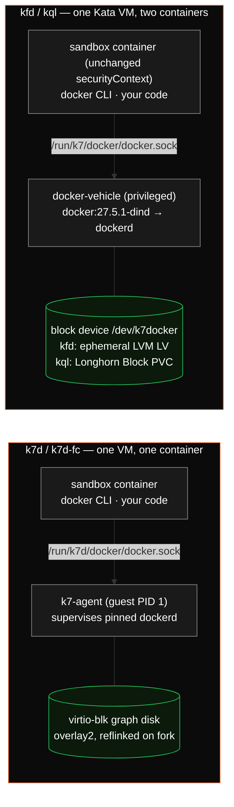

Some workloads need more than a shell — they need `docker build`, `docker run`, or `docker compose` inside the sandbox. `k7 create --docker` gives every backend the same contract:

- `docker`, `docker compose`, and `docker buildx` on `PATH` (pinned Docker **27.5.1**, Compose 2.32.4, Buildx 0.20.0) — your image does **not** need the Docker CLI.
- A pinned `dockerd` with `overlay2` on a **block** graph disk (default **20Gi**, `--docker-disk 40Gi` to change). Never vfs, never a graph on virtio-fs or emptyDir.
- `DOCKER_HOST` pre-set in the sandbox container; the socket is shared as a directory mount.
- Everything runs **inside the sandbox VM** — the isolation boundary is the VM, not the container.

```bash
k7 create --docker --backend k7d --egress-open builder ubuntu:24.04
k7 exec builder -- docker info | grep 'Storage Driver'   # overlay2
k7 exec builder -- docker pull alpine:3.21
# Interactive `k7 shell` is node-local; from a laptop keep using exec.
```

Or in YAML / the API:

```yaml
name: builder
image: ubuntu:24.04
backend: k7d            # kfd / kql / k7d / k7d-fc
docker: true
docker_disk: 40Gi       # optional, default 20Gi
```

<Note>
`--sidecar docker` (and `sidecar: docker`) is a **deprecated alias** of `--docker`. It still resolves, but the old dind sidecar with a tmpfs / subPath graph is gone: the alias now provisions the same block-backed overlay2 engine described here.
</Note>

## How it runs on each backend

The user-visible contract is identical; what differs is where `dockerd` lives and what happens to the graph disk across pause, fork, and restore.



| Backend | Where `dockerd` runs | Graph disk | Pause / resume | `k7 fork` | `k7 restore` |
|---|---|---|---|---|---|
| `k7d` | **Guest agent service** — no extra CRI container, the sandbox container is not privileged. Pod is stamped `k7d.katakate.org/docker=true` | Per-sandbox virtio-blk scratch image (`k7d.katakate.org/docker-disk`), deleted with the VM | ✅ VM frozen in place; graph intact | ✅ **Warm CoW fork of the live engine** — the child keeps `dockerd`, its images, and running inner containers (graph disk is reflinked) | ❌ (k7d has no named snapshots) |
| `k7d-fc` | Same guest service, VM under the Firecracker jailer | Same | ✅ graph intact; resume→exec needs Firecracker **v1.16.2+** (see [k7d-fc](/k7/concepts/backends#k7d-fc)) | ✅ Same, child stays overlay2 | ❌ |
| `kql` | Privileged **`docker-vehicle`** container in the same Kata VM; the sandbox container's security context is unchanged | Second Longhorn **Block** PVC `<name>-docker-lh` (ext4, overlay2) | ✅ Graph persists on the PVC; `--snapshot` snapshots both volumes | ✅ Disk clone of root **and** graph PVC, then cold boot | ✅ Both PVCs restored |
| `kfd` | Privileged `docker-vehicle` in the same Kata VM | Generic ephemeral volume from StorageClass `k7-docker-lvm` (OpenEBS LVM LocalPV over `kata-vg/thin-pool`), deleted with the pod | Scale to 0 / 1 — graph lost | ❌ Rejected (`k7 fork of a kfd --docker sandbox is not supported`) | ❌ |

<Info>
On kql the two VolumeSnapshots (root + docker graph) are crash-consistent **per volume**, not atomic across both. k7 syncs the vehicle before snapshotting, but an inner container mid-write can still land on either side of the cut.
</Info>

### k7d / k7d-fc: dockerd as a guest service

The k7d guest agent (PID 1) starts a pinned `dockerd` from a read-only, host-enforced payload image and puts its graph on a dedicated scratch disk. Inner containers share the guest kernel and network namespace with the sandbox container, and the sandbox paths `/home`, `/root`, `/tmp`, `/opt`, and `/workspace` are exported into the engine so `docker run -v "$PWD:/src"` from your working directory works as expected.

Because `dockerd` is not a Kubernetes sidecar, `k7 fork` clones it like any other in-VM process: a warm fork of a `--docker` sandbox comes up with `Storage Driver: overlay2` and the source's images and containers already present. This is the only backend where the Docker engine itself is forkable.

Requires k7d **0.6.0+** (the release tarball ships the guest docker payload; `k7 install --backend k7d` installs it to `/usr/local/share/k7d/docker`). An older k7d fails create loudly: `this k7d has no docker service; upgrade`.

Inside the guest, `docker.sock` is guest root — the sandbox `securityContext` no longer bounds what runs in the VM. For mutually distrusting tenants, use **`k7d-fc`**: identical guest side, plus a per-VM jailer around the VMM. See the [k7d security notes on `--docker`](/k7d/concepts/security#docker-as-a-guest-service).

### kfd / kql: the docker-vehicle

On the Kata backends k7 injects one privileged `docker-vehicle` container (`docker:27.5.1-dind`, digest-pinned) into the pod. It formats and mounts the block device `/dev/k7docker`, then runs `dockerd --storage-driver=overlay2` on a directory socket at `/run/k7/docker/docker.sock`. An init step copies the pinned CLI and plugins into the sandbox container. Within one Kata VM the vehicle and the sandbox are a single trust domain; the isolation boundary is the VM.

The sandbox waits for the vehicle's readiness probe (`docker info` reporting `overlay2`) before `before_script` runs.

## Measured

Medians of 3 on one Hetzner AX41 node (Ryzen 5 3600, 64 GiB, NVMe), 3Gi / 4 CPU guests, `DOCKER_BUILDKIT=0`. Full tables and ranges: [PERFORMANCE.md](https://github.com/Katakate/k7/blob/main/PERFORMANCE.md).

| Operation | `k7d` | `k7d-fc` | `kql` (overlay2 on Longhorn block) |
|---|---|---|---|
| `docker pull debian:12-slim` | 11.3 s | 8.16 s | — |
| `docker build` (no cache) | 52.0 s | 51.6 s | — |
| `docker build` (cached) | 469 ms | 470 ms | — |
| run io (2k small files + 512 MB fsync) | 1.18 s | 1.28 s | 4.24 s |
| fork of a warm engine → Ready + overlay2 child | 6.79 s | 9.13 s | n/a |

The `run io` row is the point of the block graph: the old dind sidecar on a tmpfs / subPath graph fell back to `vfs` and took ~37 s on the same workload.

## Network considerations

Inner containers share the sandbox's network namespace. **Traffic spawned by `dockerd`** (image pulls, containers dialing out) flows through the VM's network stack and is subject to the sandbox's egress policy. `k7 create` without an egress flag is **block-all**, so pulls will hang; whitelist the registry:

```yaml
docker: true
egress_whitelist:
  - "registry-1.docker.io"
  - "auth.docker.io"
  - "*.docker.com"          # any-depth subdomains, not the apex
  - "docker.com"
  - "ghcr.io"
  - "*.pkg.github.com"
```

`*.docker.com` matches `production.cloudflare.docker.com` (and any other CDN host under that suffix) but **not** `docker.com` itself — add the apex separately. See [Networking](/k7/concepts/networking).

## Reference

- Pins and helpers: [`src/k7/core/docker.py`](https://github.com/Katakate/k7/blob/main/src/k7/core/docker.py)
- Kata vehicle script: [`src/k7/assets/k7-docker-vehicle.sh`](https://github.com/Katakate/k7/blob/main/src/k7/assets/k7-docker-vehicle.sh)
- Backend comparison: [Backends](/k7/concepts/backends)
