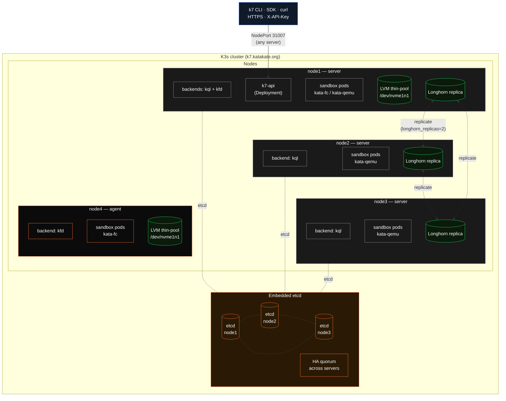

Katakate scales horizontally via multi-node K3s clusters, configured with an Ansible-style inventory. This guide explains the inventory format, the HA story, and how to mix backends across nodes.

## Why multi-node?

- **Horizontal scale** — more nodes, more sandboxes.
- **Replicated storage** — Longhorn keeps multiple replicas of every volume across nodes (`numberOfReplicas` configurable). Data survives a node failure.
- **Workload locality** — pods land on nodes whose backend matches the requested `--backend`.
- **High availability of the control plane** — embedded etcd across 3+ K3s servers.

## Topology at a glance

A typical 3-server + 1-agent cluster with mixed backends and Longhorn replication:



What this shows:

- **Any server** can serve the API NodePort — clients can hit any of `node1..3` on `:31007`.
- **etcd quorum** spans the three servers. One server can fail without losing the control plane.
- **Backend labels** decide where a sandbox lands. `--backend kfd` is restricted to `node1` and `node4`; `--backend kql` to `node1`, `node2`, `node3`.
- **Longhorn replicas** of each `kata-qemu-longhorn` PVC are spread across `kql`-capable nodes (`longhorn_replicas=2` keeps two copies; `dataLocality: best-effort` keeps one local to the pod).
- **Devmapper thin-pools** are per-node and not replicated — `kata-firecracker-devmapper` sandboxes are ephemeral by design.

## Inventory format

`k7 install -i inventory.ini` reads a standard Ansible INI inventory. Each host declares which backend(s) it supports via `k7_backends` (comma-separated).

A complete example ([`src/k7/deploy/inventory.ini.example`](https://github.com/Katakate/k7/blob/main/src/k7/deploy/inventory.ini.example)):

```ini
[k7_servers]
node1 ansible_host=192.0.2.10 k7_backends=kata-qemu-longhorn,kata-firecracker-devmapper k7_devmapper_disk=/dev/nvme1n1
node2 ansible_host=5.9.18.222 k7_backends=kata-qemu-longhorn
node3 ansible_host=5.9.18.223 k7_backends=kata-qemu-longhorn

[k7_agents]
node4 ansible_host=5.9.18.224 k7_backends=kata-firecracker-devmapper k7_devmapper_disk=/dev/nvme1n1

[k7_cluster:children]
k7_servers
k7_agents

[k7_cluster:vars]
ansible_user=root
ansible_ssh_private_key_file=~/.ssh/id_ed25519
longhorn_replicas=2
```

### Per-host variables

| Variable | Required | Description |
|----------|----------|-------------|
| `ansible_host` | yes | SSH target IP or hostname |
| `ansible_user` | yes | SSH user (commonly `root` on bare-metal) |
| `k7_backends` | yes | Comma-separated list of backends supported by this node. Values: `kata-qemu-longhorn`, `kata-firecracker-devmapper`, `k7d` |
| `k7_devmapper_disk` | for `kata-firecracker-devmapper` | **Raw, unformatted** block device for the LVM thin-pool (e.g. `/dev/nvme1n1`). Wipe with `utils/wipe-disk.sh` first. |
| `longhorn_extra_disk` | optional, `kata-qemu-longhorn` only | Existing **mount path** (e.g. `/mnt/longhorn-extra`) to register as an extra Longhorn disk. **Not** a `/dev/...` device — format and mount it yourself first. Without this, Longhorn uses `longhorn_data_path` (default `/var/lib/longhorn`) on the root filesystem. |

### Group variables (`[k7_cluster:vars]`)

| Variable | Default | Description |
|----------|---------|-------------|
| `ansible_user` | `root` | SSH user for all hosts |
| `ansible_ssh_private_key_file` | `~/.ssh/id_rsa` | Private key used for SSH |
| `longhorn_replicas` | `min(3, node count)` | Longhorn replica count |
| `longhorn_data_path` | `/var/lib/longhorn` | Longhorn data directory |

## Roles: servers vs agents

- **`[k7_servers]`** — K3s control-plane nodes. The **first host listed becomes the cluster-init server**; subsequent servers join it (HA via embedded etcd).
- **`[k7_agents]`** — K3s worker nodes. They join the first server with the K3s join token.

Servers can also schedule sandboxes (they aren't tainted).

### Single-master vs HA

- **1 server**: the simplest setup; no HA. Failure of the server takes the cluster down.
- **2 servers**: **avoid** — embedded etcd has no fault tolerance with even counts. Better: 1 server + 1 agent.
- **3+ servers** (odd numbers): full HA. Quorum tolerates `(N-1)/2` server failures.

## Mixed backends per node

A node can advertise both backends in `k7_backends`:

```ini
node1 ansible_host=... k7_backends=kata-qemu-longhorn,kata-firecracker-devmapper k7_devmapper_disk=/dev/nvme1n1
```

The playbook installs both Kata runtime classes (`kata-fc` and `kata-qemu`), merges containerd configs, and labels the node with **both**:

```
k7.katakate.org/backend-kata-qemu-longhorn=true
k7.katakate.org/backend-kata-firecracker-devmapper=true
```

When you `k7 create --backend kql ...`, the scheduler uses `nodeSelector: { k7.katakate.org/backend-kata-qemu-longhorn: "true" }` to land the pod on a compatible node. If no compatible node exists, k7 detects the `FailedScheduling` event and returns a clear error listing which backends are actually available.

## Longhorn topology and replication

Longhorn is configured to be topology-aware:

- **`volumeBindingMode: WaitForFirstConsumer`** — the PVC binds when the pod is scheduled, ensuring the volume is created on the node where the pod will run.
- **`dataLocality: best-effort`** — Longhorn keeps one replica on the same node as the pod (reduces network reads).
- **`replica-auto-balance: best-effort`** — replicas auto-spread across nodes.

Practical effect: writing to `/mnt/state` from inside the sandbox stays on the local node when possible, and the data has redundant replicas elsewhere in the cluster. If the pod's node fails, the Deployment reschedules onto another node and Longhorn re-attaches the volume from a surviving replica.

## Joining nodes incrementally

You don't have to install everything in one shot. To add an agent to a running cluster:

```bash
# On the new node, after `apt install k7`:
k7 install \
  --role agent \
  --join https://master.example.com:6443 \
  --join-token "$(ssh master 'sudo cat /var/lib/rancher/k3s/server/node-token')" \
  --backend kql
```

To add a new server (HA):

```bash
k7 install \
  --role server \
  --join https://master.example.com:6443 \
  --join-token "..." \
  --ha
```

For a fresh **3-server HA cluster**, prefer the inventory-based install — it handles token distribution and join ordering automatically.

## CNI choice across the cluster

Cilium (the default) is cluster-wide and applies its eBPF datapath uniformly across nodes. FQDN egress works regardless of which node the sandbox lands on. If you pass `--cni flannel`, every node uses Flannel and FQDN egress is unavailable cluster-wide.

## Verification

After `k7 install -i inventory.ini`:

```bash
# Cluster nodes
sudo k3s kubectl get nodes -o wide

# Per-backend labels
sudo k3s kubectl get nodes --show-labels | grep katakate

# Cilium health
sudo k3s kubectl -n kube-system get pods -l k8s-app=cilium

# Longhorn
sudo k3s kubectl -n longhorn-system get nodes,replicas

# k7-api pod
sudo k3s kubectl -n kube-system get deploy/k7-api -o wide
k7 api-status
```

A clean cluster will show all nodes `Ready`, Cilium pods `Running`, the k7-api Deployment with `1/1 ready`, and Longhorn replicas distributed across nodes.

## Reference

- Example inventory: [`src/k7/deploy/inventory.ini.example`](https://github.com/Katakate/k7/blob/main/src/k7/deploy/inventory.ini.example)
- Ansible playbook: [`src/k7/deploy/k7-install-node.yaml`](https://github.com/Katakate/k7/blob/main/src/k7/deploy/k7-install-node.yaml)
