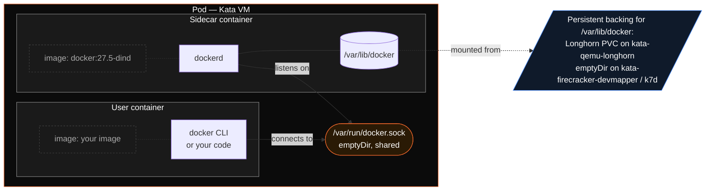

Some workloads need more than just a shell — they need a **daemon** that the user code can talk to. The classic example is `docker build`, which expects a Docker daemon listening on a Unix socket. K7 ships a generic **sidecar framework** that injects a daemon container into the sandbox pod and shares a socket with the main container — all inside the same Kata VM, without crossing the sandbox boundary.

The first sidecar type ships today: **`docker`** (Docker-in-VM via `docker:27.5-dind`). Future types (`containerd` for nested K3s, etc.) plug into the same registry without touching `core.py`.

## Why sidecars (not Docker-in-Docker)?

Docker-in-Docker (DinD) runs `dockerd` inside the user container with `--privileged` and overlay-on-overlay storage. It works but is fragile, has cgroup edge cases, and storage overhead.

The sidecar model separates concerns:



- The **daemon** runs in its own container — its filesystem, its lifecycle.
- The **socket** is shared via an `emptyDir` volume that both containers mount.
- The **daemon's persistent data** (`/var/lib/docker`) lives on the Longhorn PVC (kata-qemu-longhorn) or an `emptyDir` (kata-firecracker-devmapper).
- Both containers run **inside the same Kata VM** — no escape from the sandbox boundary.

## Run Docker inside a sandbox

```bash
k7 create --sidecar docker --backend kql my-builder docker:27.5-cli
```

Or in YAML:

```yaml
name: my-builder
image: docker:27.5-cli
backend: kata-qemu-longhorn
sidecar: docker
```

<Info>
The user container needs the Docker **client** (`docker` CLI). Use `docker:27.5-cli` as a base or `apt install docker.io` on Debian/Ubuntu images.
</Info>

Then exec or shell into it and use Docker as usual:

```bash
k7 shell my-builder

# Inside the sandbox:
docker info                          # daemon ready
docker pull alpine:3.21
docker build -t myapp .
docker run --rm myapp
docker compose up
```

## Storage and lifecycle

| Backend | Sidecar data path | Survives pause/resume? | Survives fork? |
|---------|------------------|------------------------|----------------|
| `kata-qemu-longhorn` | Longhorn PVC subdir (`/var/lib/docker` → `<pvc>/docker/`) | ✅ Yes | ✅ Yes (Longhorn snapshot includes it) |
| `kata-firecracker-devmapper` | `emptyDir` (ephemeral) | ❌ No persistent disk | ❌ |
| `k7d` | `emptyDir` (VM-lifetime) | ✅ Yes (the VM is frozen in place; memory and disk survive) | ❌ Fork of a sandbox **with a sidecar** is rejected on k7d — use `kql` for that |

On `kata-qemu-longhorn`:

- An init container (`init-state`) creates `/mnt/state/docker/` on the PVC before the sidecar starts.
- Pulled images and built layers persist across pause/resume.
- `k7 fork` clones the entire PVC, including the Docker layer cache — the forked sandbox starts with the same images.

On `kata-firecracker-devmapper`:

- Each pod restart wipes the Docker state.
- Fork is unavailable on this backend anyway.

On `k7d`:

- Docker data lives for the **lifetime of the VM** — pause/resume keep it (nothing is torn down), but it does not survive pod deletion.
- k7d's warm fork currently supports single-workload sandboxes only; a sidecar-equipped sandbox cannot be forked.

## Readiness ordering

When a sidecar is configured, k7 waits for **all containers** in the pod to be `ready` before marking the sandbox ready (the `dockerd` readiness probe runs `docker info`). Your `before_script` won't run until the daemon is up.

## Available sidecar types

The registry lives in [`src/k7/core/sidecar.py`](https://github.com/Katakate/k7/blob/main/src/k7/core/sidecar.py):

| Type | Image | Socket | Data path | Status |
|------|-------|--------|-----------|--------|
| `docker` | `docker:27.5-dind` | `/var/run/docker.sock` | `/var/lib/docker` | ✅ Shipped |
| `containerd` | `containerd:1.7` | `/run/containerd/containerd.sock` | `/var/lib/containerd` | 🛠️ Planned |

Adding a new sidecar type is a single registry entry — no changes to the CLI, models, or core orchestration logic.

## Network considerations

Sidecar containers share the pod's network namespace. **Traffic spawned by the daemon** (Docker containers, registry pulls, etc.) flows through the **VM's** network stack and is subject to the sandbox's `NetworkPolicy` / `CiliumNetworkPolicy`. To pull images from outside, whitelist the registry:

```yaml
sidecar: docker
egress_whitelist:
  - "registry-1.docker.io"
  - "auth.docker.io"
  - "production.cloudflare.docker.com"
  - "ghcr.io"
  - "*.pkg.github.com"
```

## Reference

- Sidecar registry: [`src/k7/core/sidecar.py`](https://github.com/Katakate/k7/blob/main/src/k7/core/sidecar.py)
- Pod assembly: [`src/k7/core/core.py`](https://github.com/Katakate/k7/blob/main/src/k7/core/core.py)
